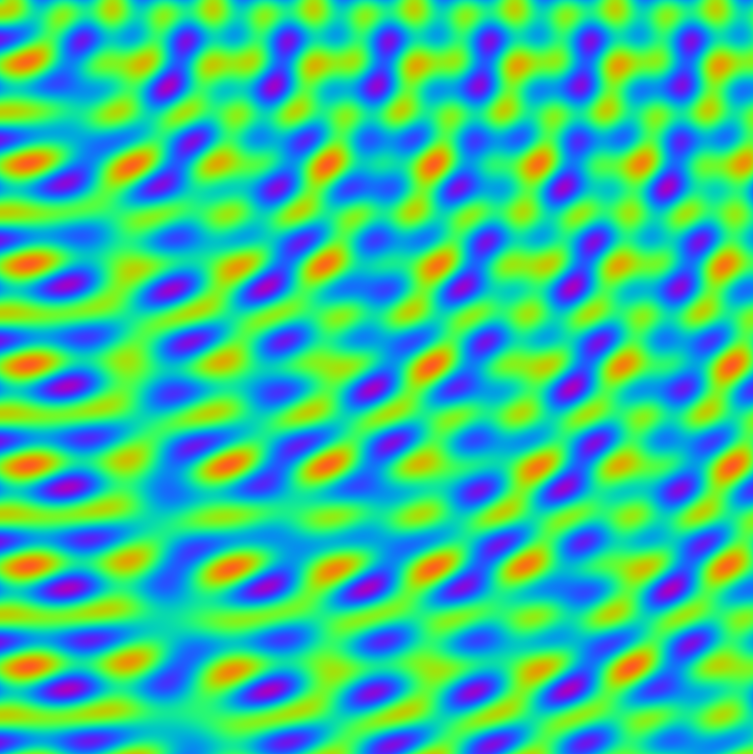
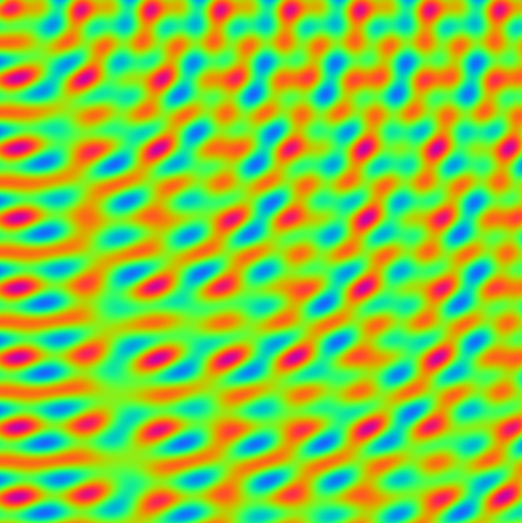
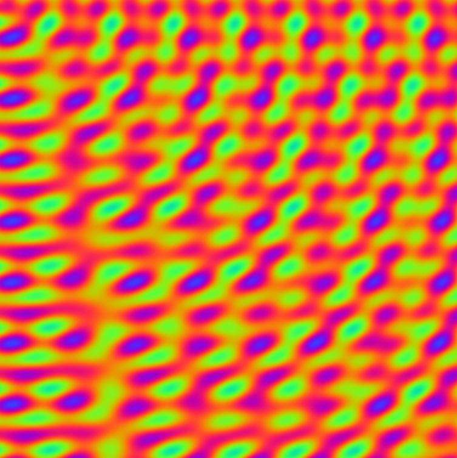
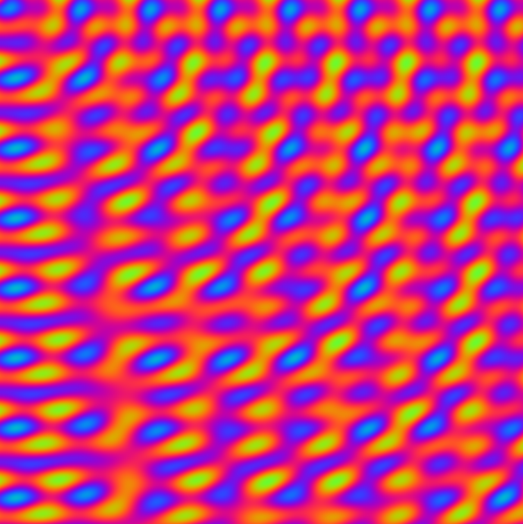

# plasma

## Plasma Effect Screenshots










## Build Instructions

To build the plasma application with SDL2, use:

```
g++ -g plasma.cpp -o plasma -lSDL2
```

Or update your VS Code build task to include `-lSDL2` in the arguments:

```
"args": [
    "-g",
    "${file}",
    "-o",
    "${fileDirname}/${fileBasenameNoExtension}",
    "-lSDL2"
]
```

Then use the build/run tasks as before.

## TODO

1. Switch it to the true kiosk mode.